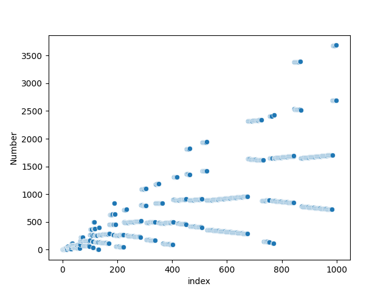
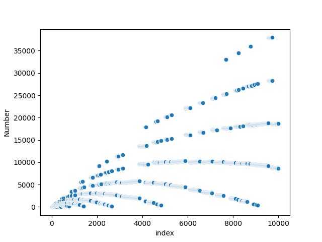
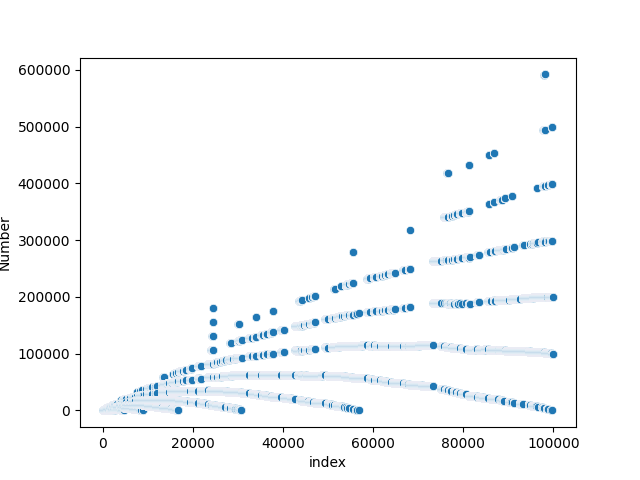
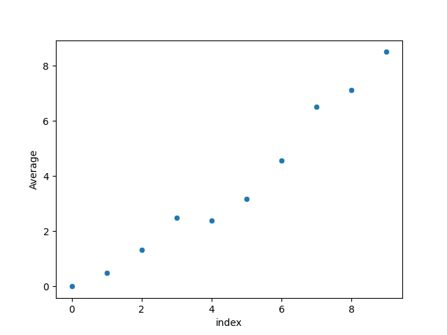
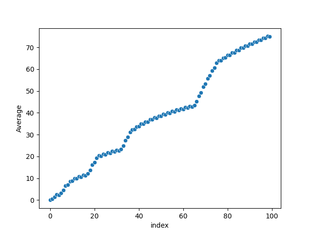
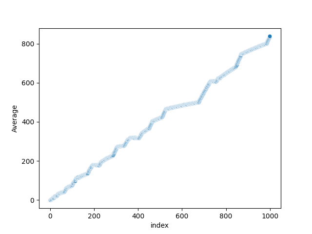
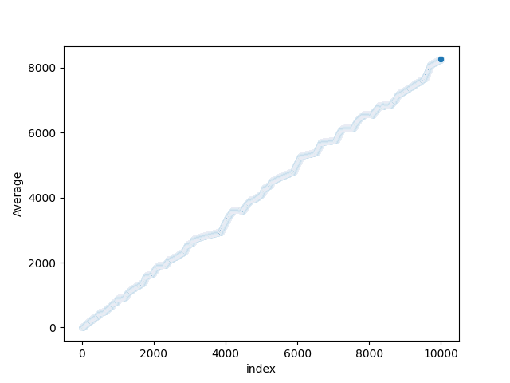
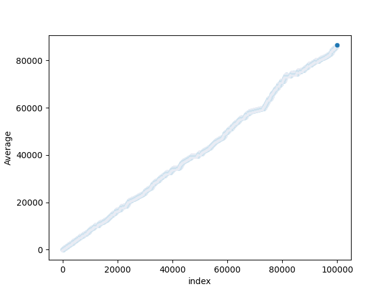

# recaman-sequence
The script `recaman_sequence.py` generates the [Recaman seqeunce](https://www.youtube.com/watch?v=FGC5TdIiT9U). 

output: `[0, 1, 3, 6, 2, 7, 13, 20, 12, 21, 11, 22, 10, 23, 9, 24, 8, 25, 43, 62, 42, 63, 41, 18, 42, 17, 43, 16, 44, 15, 45, 14, 46, 79, 113, 78, 114, 77, 39, 78, 38, 79, 37, 80, 36, 81, 35, 82, 34, 83]`

# Seaborn Plots
## Basic Scatterplots
A scatterplot of the first 1,000 numbers:

A scatterplot of the first 10,000 numbers:

A scatterplot of the first 100,000 numbers:

## Plotting the Average as $n \to \infty$
Scatterplot of the first 10 averages:

Scatterplot of the first 100 averages:

Scatterplot of the first 1,000 averages:

Scatterplot of the first 10,000 averages:

Scatterplot of the first 100,000 averages:
